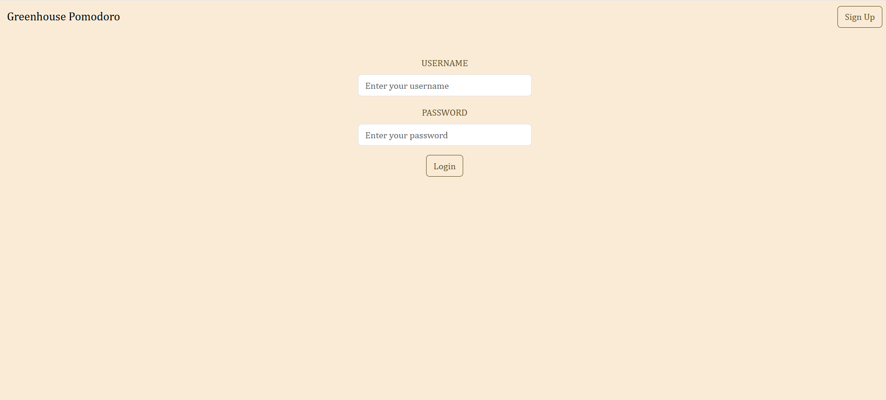
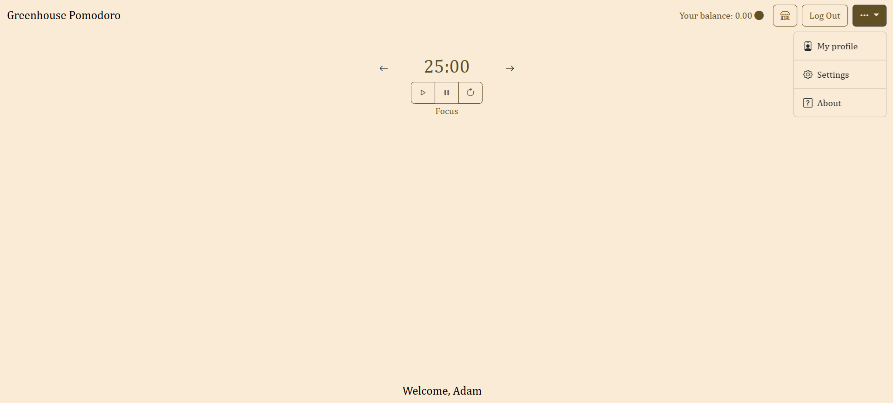
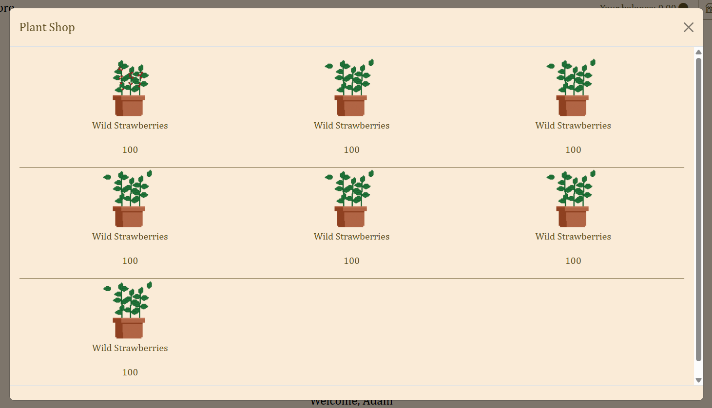

# 🪴 Greenhouse Pomodoro

Greenhouse Pomodoro to minimalistyczna aplikacja do zarządzania czasem pracy metodą Pomodoro, 
zaprojektowana z myślą o spokojnej atmosferze i skupieniu. Interfejs inspirowany naturą i szklarnianą estetyką sprawia, 
że praca staje się bardziej harmonijna 🌿

## 🖼️ Wygląd aplikacji

## 🔧 Funkcje

- Funkcja Pomodoro (25/5/15 minut – konfigurowalne)
- Powiadomienia dźwiękowe na koniec cyklu

## ✅ Planowany rozwój

- Dodanie punktów za zakończenie ważdej sesji Focus
- Zmiana tła na inspirowane szklarnią
- Dodanie sklepu - możliwośc zakupu roślin do szklarni - tła i możliwość dodania ich do widoku głównego

## 📦 Instalacja

git clone https://github.com/twoj-uzytkownik/greenhouse-pomodoro.git  
cd greenhouse-pomodoro  
python -m venv venv  
venv\Scripts\activate  
pip install -r requirements.txt  
python manage.py migrate  
python manage.py runserver  

Aplikacja będzie dostępna pod adresem: http://127.0.0.1:8000/main

